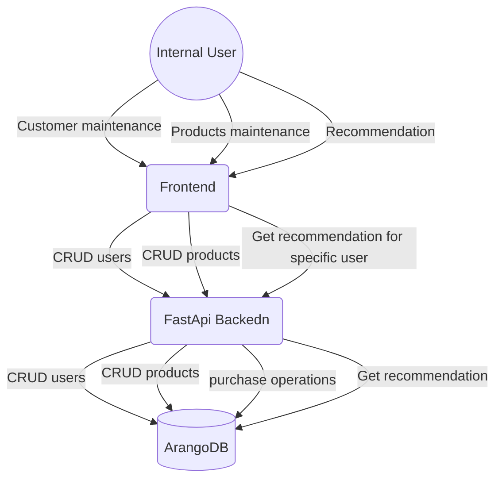
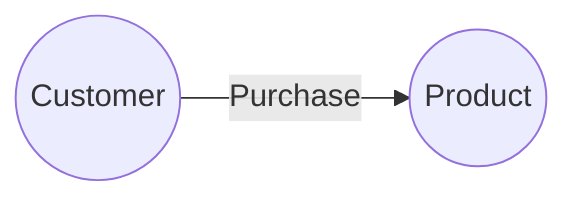

# datenna-assessment
<!-- TOC -->

- [datenna-assessment](#datenna-assessment)
  - [Quickstart](#quickstart)
  - [Project design](#project-design)
  - [Graph and DB design](#graph-and-db-design)
  - [Administrative actions](#administrative-actions)
  - [Decisions](#decisions)
  - [Code Structure](#code-structure)
    - [routes](#routes)
    - [repository and service](#repository-and-service)
    - [Schemas](#schemas)
    - [Queries](#queries)
  - [What was not implemented](#what-was-not-implemented)

<!-- /TOC -->

## Quickstart

The easiest way to start everything:

```bash
docker compose up --build
```

and access the documentation page via [local OpenAPI ](http://localhost/docs) or [redoc](http://localhost/redoc)


## Project design

> **NOTE:** The diagrams are drawn using [mermaid](https://www.mermaidchart.com/). Github natively renders it. If your editor don't renders it natively, you can add plugins to do it. Example for [vscode](https://marketplace.visualstudio.com/items?itemName=yzhang.markdown-all-in

Ideally, a Frontend application would be the interface with the backend, avoiding manual calls to the back end API. Here, the front end for internal users and customers are separated to separate the possible calls each user can do.

This assessment will cover only the internal user actions, due to time restrictions.



Authentication and authorization are also out of scope in this design, but have to be addressed by an external party, like oauth0/okta.

## Graph and DB design

I planned this initial structure with simplicity in mind, but allowing further expansion. For now it is a conjunction of two node types and one edge



I am using arangodb to maintain the DB and to perform queries. offloading the queries to the DB instead of application, improves performance, alows better resource management, and dynamic querying. It is worth noting the sample DB created has 10.000 customers, 10.000 products, and 100.000 purchases, without any hiccups.

## Administrative actions

In a real world application, some tasks should be done during deployment processes, like creating databases, getting creadentials, give permissions, etc... The tasks that are relevant for this assignment were added in the API under the Administrative tag.

Since this is not expeceted to run in a valid environment, it also allows the user to perform things that can result in a crash. It is an expected behavior.

## Decisions

Instead of doing things in the API memory, which is not scalable, it was decided to implement it connecting to a database, maitaining state and offloading queries to the DB server. Since the database is being considered only a repository, queries should not be stored internally, rather passed via API. This decision initially does not take in account heavy queries that require a long time of execution.

ArangoDB was a personal choice. Any other Graph database could be used, but it requires a new repository and/or service to accomodate the changes.

## Code Structure

The encapsulation of configs, database repository, services, and other components, allow us to implement better tests (by mocking the classes/functions), loose coupling, and keep the code cleaner.


The code is strucured as follows:

### routes

This is the user entrypoint in the API. Each router file is a different tag in the openapi page. A minimal amount of logic should be here. Ideally it just calls the repo, or a service to execute an action.

### repository and service
Following industry standards to implement a repository to manage the CRUD operations, and queries. This is the connection between the API and DB.
The service pattern is being used to perform actions in the database directly. This is not exposed to the API directly, and only the repository should call it.

If new connections are needed, like call to an external service, it should be added in the services directory.

If other databases are needed, they should go under repository directory.

### Schemas

The schemas create the adapters for external communication. they validate and sanitize the inputs before going any further. This prevents unnecessary execution time, and protects the application.

### Queries
The aql directory holds all the queries that can be executed by the API. The repository has a function that load a file and execute it, returning the output to the user


## What was not implemented

Due to time restrictions (and me being sick for the week), some features that I would add in a real project were not added here:

- admin/Populate should allow the user to input the size of the population, instead of the 10.000 hard fixed.
- Automate linter, sort, coverage, formatting
  - currently the code ```ruff check src --exclude src/aql --fix``` is executed manually
- Pytest for unit test and integration tests
  - including mock the services/repo
- propper logging
  - currently the logging exist only in core functionality, but it would be better to add more log messages in other points as well
- Improved error handling
  - In most cases it will log the error and just raise it again (so sentry can catch it)
- github actions
  - having this to be executed when the code is changed or in a pull request would be a good example of how to validate before push
- Better explained commits